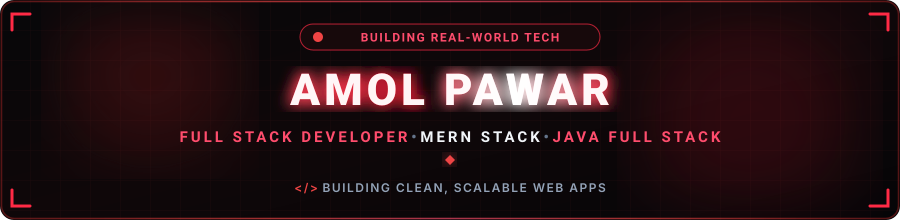

<!-- ═══════════════════════════════════════════════════════════════ -->
<!--                     HEADER BANNER SECTION                      -->
<!-- ═══════════════════════════════════════════════════════════════ -->

 

### 🚀 &nbsp;What I Do

 

<!-- ═══════════════════════════════════════════════════════════════ -->
<!--                     SOCIAL / QUICK LINKS                       -->
<!-- ═══════════════════════════════════════════════════════════════ -->

&nbsp;

&nbsp;

&nbsp;

&nbsp;

&nbsp;

  

&nbsp;

&nbsp;

&nbsp;

 

<!-- ═══════════════════════════════════════════════════════════════ -->
<!--                         ABOUT ME                               -->
<!-- ═══════════════════════════════════════════════════════════════ -->

<h2 align="center">🔴 About Me</h2>

  

Hey! I'm **Amol Pawar**, a passionate **Full Stack Developer** based in Maharashtra, India.
I specialize in building clean, scalable web applications using the **MERN stack**, with hands-on experience in **React.js**, a working knowledge of **Java Full Stack** development, and a growing focus on **AI-powered applications**.

- 🚀 &nbsp;**Full Stack Developer** — MERN Stack (React, Node.js, MongoDB) &amp; Java Full Stack
- 🤖 &nbsp;**Exploring AI** — integrating AI tools and models into full-stack projects
- 💼 &nbsp;**1 year of experience** as a React.js Developer
- 🌱 &nbsp;Currently deepening my skills across React, Node.js, and system design
- 📍 &nbsp;Based in Maharashtra, India
- 🟢 &nbsp;Open to full-stack development opportunities
- ⚡ &nbsp;Fun fact: Code. Break. Fix. Repeat.

  
  &nbsp;
  
  &nbsp;
  

💬 &nbsp;**Let's Discuss:** JavaScript, React.js, Node.js, MongoDB, Java, AI Integration, Full Stack Architecture &amp; Git Workflows.
⚡ &nbsp;**Philosophy:** *"Turning random ideas into production-ready code."*

 

<!-- ═══════════════════════════════════════════════════════════════ -->
<!--                       TECH SKILLS                              -->
<!-- ═══════════════════════════════════════════════════════════════ -->

<h2 align="center">🔴 Tech Stack &amp; Skills</h2>

<!-- Core Languages -->

<b>Core Languages</b>

  

<!-- Frontend Development -->

<b>Frontend Development</b>

  

<!-- Backend Development -->

<b>Backend Development</b>

  

<!-- Database -->

<b>Database</b>

  

<!-- Tools & AI -->

<b>Tools &amp; AI</b>

  

 

<!-- ═══════════════════════════════════════════════════════════════ -->
<!--                     FEATURED PROJECTS                          -->
<!-- ═══════════════════════════════════════════════════════════════ -->

<h2 align="center">🔴 Featured Projects</h2>

<table width="100%" border="0" align="center">

<tr>
<td align="center" width="50%" style="padding: 22px;">
  <h3>🌐 BPL Official</h3>
  
<i>A modern, responsive platform built on React/Next.js with a Node.js backend.</i>

  

    
    
    
  

  

    
    &nbsp;
    
  

</td>

<td align="center" width="50%" style="padding: 22px;">
  <h3>🛠️ BPL Admin Dashboard</h3>
  
<i>Feature-rich dashboard with real-time data management and a clean UI.</i>

  

    
    
    
  

  

    
    &nbsp;
    
  

</td>
</tr>

<tr>
<td align="center" width="50%" style="padding: 22px;">
  <h3>⚙️ BPL Backend API</h3>
  
<i>RESTful API built with Express &amp; MongoDB powering the entire BPL ecosystem.</i>

  

    
    
    
  

  

    
    &nbsp;
    
  

</td>

<td align="center" width="50%" style="padding: 22px;">
  <h3>💼 Portfolio Website</h3>
  
<i>Personal portfolio showcasing projects, skills &amp; experience — fully responsive.</i>

  

    
    
    
  

  

    
    &nbsp;
    
  

</td>
</tr>

</table>

 

<!-- ═══════════════════════════════════════════════════════════════ -->
<!--                      GITHUB STREAK                             -->
<!-- ═══════════════════════════════════════════════════════════════ -->

### 🔥 GitHub Streak

 

<!-- ═══════════════════════════════════════════════════════════════ -->
<!--                     GITHUB DASHBOARD                           -->
<!-- ═══════════════════════════════════════════════════════════════ -->
<!--
  NOTE: Everything between START_SECTION and END_SECTION below is
  auto-generated by scripts/generate-dashboard.js via GitHub Actions.
  Do not edit this block by hand — your edits will be overwritten on
  the next workflow run. Edit the generator script instead.
-->

## 📊 GitHub Dashboard

<!--START_SECTION:github-dashboard-->

### ⚡ GitHub Statistics

Automatically generated from GitHub data

<table align="center">

<tr>

<td align="center">
<strong>📦 12</strong>
 
Repositories
</td>

<td align="center">
<strong>⭐ 0</strong>
 
Stars
</td>

<td align="center">
<strong>🍴 0</strong>
 
Forks
</td>

<td align="center">
<strong>👥 0</strong>
 
Followers
</td>

<td align="center">
<strong>🐛 0</strong>
 
Open Issues
</td>

</tr>

</table>

 

### 🏆 Top Repositories

<table width="100%">

<tr>
<th align="center">#</th>
<th>Repository</th>
<th align="center">Language</th>
<th align="center">⭐</th>
<th align="center">🍴</th>
</tr>

<tr>
<td align="center"><strong>1</strong></td>
<td>
<a href="https://github.com/amolpawar24/Advanced-Java"><strong>Advanced-Java</strong></a>
 
A comprehensive Advanced Java learning repository covering Multithreading, Concurrency, File Handlin...
</td>
<td align="center">—</td>
<td align="center">0</td>
<td align="center">0</td>
</tr>

<tr>
<td align="center"><strong>2</strong></td>
<td>
<a href="https://github.com/amolpawar24/Amol-Portfolio"><strong>Amol-Portfolio</strong></a>
 
Personal portfolio website highlighting my work, technical skills, and projects — built to demonstra...
</td>
<td align="center">SCSS</td>
<td align="center">0</td>
<td align="center">0</td>
</tr>

<tr>
<td align="center"><strong>3</strong></td>
<td>
<a href="https://github.com/amolpawar24/AmolPawar24"><strong>AmolPawar24</strong></a>
</td>
<td align="center">JavaScript</td>
<td align="center">0</td>
<td align="center">0</td>
</tr>

<tr>
<td align="center"><strong>4</strong></td>
<td>
<a href="https://github.com/amolpawar24/Bike-Rental"><strong>Bike-Rental</strong></a>
 
🏍️ Modern & Responsive Bike Rental Website \| Explore Bikes, Scooters, Rental Categories, Brands, Ga...
</td>
<td align="center">CSS</td>
<td align="center">0</td>
<td align="center">0</td>
</tr>

<tr>
<td align="center"><strong>5</strong></td>
<td>
<a href="https://github.com/amolpawar24/Core-Java"><strong>Core-Java</strong></a>
 
☕ Core Java concepts, practical programs, OOP, Collections, Exception Handling, Strings, Arrays & mo...
</td>
<td align="center">Java</td>
<td align="center">0</td>
<td align="center">0</td>
</tr>

<tr>
<td align="center"><strong>6</strong></td>
<td>
<a href="https://github.com/amolpawar24/CSS3"><strong>CSS3</strong></a>
 
🎨 Master CSS3 from fundamentals to advanced concepts with selectors, box model, Flexbox, Grid, resp...
</td>
<td align="center">—</td>
<td align="center">0</td>
<td align="center">0</td>
</tr>

</table>

 

### 💻 Code Distribution

 

<table width="100%">

<tr>
<th>Language</th>
<th align="right">Usage</th>
</tr>

<tr>
<td><strong>SCSS</strong></td>
<td align="right"><strong>25.6%</strong></td>
</tr>

<tr>
<td><strong>TypeScript</strong></td>
<td align="right"><strong>21.8%</strong></td>
</tr>

<tr>
<td><strong>HTML</strong></td>
<td align="right"><strong>19.3%</strong></td>
</tr>

<tr>
<td><strong>JavaScript</strong></td>
<td align="right"><strong>16.7%</strong></td>
</tr>

<tr>
<td><strong>CSS</strong></td>
<td align="right"><strong>14.6%</strong></td>
</tr>

<tr>
<td><strong>Java</strong></td>
<td align="right"><strong>2.0%</strong></td>
</tr>

</table>

 

### 🚀 Recent Repository Activity

<table width="100%">

<tr>
<th>Repository</th>
<th align="center">Language</th>
<th align="right">Updated</th>
</tr>

<tr>
<td><a href="https://github.com/amolpawar24/Pepsi-Website-Clone"><strong>Pepsi-Website-Clone</strong></a></td>
<td align="center">CSS</td>
<td align="right">22 hrs ago</td>
</tr>

<tr>
<td><a href="https://github.com/amolpawar24/AmolPawar24"><strong>AmolPawar24</strong></a></td>
<td align="center">JavaScript</td>
<td align="right">23 hrs ago</td>
</tr>

<tr>
<td><a href="https://github.com/amolpawar24/ReactJs"><strong>ReactJs</strong></a></td>
<td align="center">JavaScript</td>
<td align="right">23 hrs ago</td>
</tr>

<tr>
<td><a href="https://github.com/amolpawar24/Core-Java"><strong>Core-Java</strong></a></td>
<td align="center">Java</td>
<td align="right">2 days ago</td>
</tr>

<tr>
<td><a href="https://github.com/amolpawar24/JavaScript"><strong>JavaScript</strong></a></td>
<td align="center">JavaScript</td>
<td align="right">3 days ago</td>
</tr>

<tr>
<td><a href="https://github.com/amolpawar24/Advanced-Java"><strong>Advanced-Java</strong></a></td>
<td align="center">—</td>
<td align="right">15 days ago</td>
</tr>

</table>

 

### 📊 Repository Commits

 

<table width="100%">

<tr>
<th>📦 Repository</th>
<th align="right">💻 Commits</th>
</tr>

<tr>
<td><a href="https://github.com/amolpawar24/Amol-Portfolio"><strong>Amol-Portfolio</strong></a></td>
<td align="right">124</td>
</tr>

<tr>
<td><a href="https://github.com/amolpawar24/Portfolio-5"><strong>Portfolio-5</strong></a></td>
<td align="right">114</td>
</tr>

<tr>
<td><a href="https://github.com/amolpawar24/JavaScript"><strong>JavaScript</strong></a></td>
<td align="right">103</td>
</tr>

<tr>
<td><a href="https://github.com/amolpawar24/AmolPawar24"><strong>AmolPawar24</strong></a></td>
<td align="right">74</td>
</tr>

<tr>
<td><a href="https://github.com/amolpawar24/ReactJs"><strong>ReactJs</strong></a></td>
<td align="right">58</td>
</tr>

<tr>
<td><a href="https://github.com/amolpawar24/Core-Java"><strong>Core-Java</strong></a></td>
<td align="right">39</td>
</tr>

<tr>
<td><a href="https://github.com/amolpawar24/Bike-Rental"><strong>Bike-Rental</strong></a></td>
<td align="right">23</td>
</tr>

<tr>
<td><a href="https://github.com/amolpawar24/HTML5"><strong>HTML5</strong></a></td>
<td align="right">17</td>
</tr>

<tr>
<td><a href="https://github.com/amolpawar24/Pepsi-Website-Clone"><strong>Pepsi-Website-Clone</strong></a></td>
<td align="right">6</td>
</tr>

<tr>
<td><a href="https://github.com/amolpawar24/Advanced-Java"><strong>Advanced-Java</strong></a></td>
<td align="right">3</td>
</tr>

<tr>
<td><a href="https://github.com/amolpawar24/CSS3"><strong>CSS3</strong></a></td>
<td align="right">3</td>
</tr>

<tr>
<td><a href="https://github.com/amolpawar24/NodeJS"><strong>NodeJS</strong></a></td>
<td align="right">3</td>
</tr>

<tr>
<td><strong>Total</strong></td>
<td align="right"><strong>567</strong></td>
</tr>

</table>

 

🕐 Last updated: 18 Sept 2026, 9:14 am IST

 

🤖 Powered by GitHub Actions

<!--END_SECTION:github-dashboard-->

 

<!-- ═══════════════════════════════════════════════════════════════ -->
<!--                       FUN QUOTE                                -->
<!-- ═══════════════════════════════════════════════════════════════ -->

 

<!-- ═══════════════════════════════════════════════════════════════ -->
<!--                  PROFILE SUMMARY                               -->
<!-- ═══════════════════════════════════════════════════════════════ -->

### 📈 Profile Summary

 

<!-- ═══════════════════════════════════════════════════════════════ -->
<!--                     CODING ACTIVITY                            -->
<!-- ═══════════════════════════════════════════════════════════════ -->

### ⌨️ Coding Activity

 

<!-- ═══════════════════════════════════════════════════════════════ -->
<!--                     FOOTER ANIMATIONS                          -->
<!-- ═══════════════════════════════════════════════════════════════ -->

 

<!-- ═══════════════════════════════════════════════════════════════ -->
<!--                     SNAKE ANIMATION                            -->
<!-- ═══════════════════════════════════════════════════════════════ -->

 

<!-- ═══════════════════════════════════════════════════════════════ -->
<!--                     ACTIVITY GRAPH                             -->
<!-- ═══════════════════════════════════════════════════════════════ -->

 

<!-- ═══════════════════════════════════════════════════════════════ -->
<!--                     VISITOR COUNTER                            -->
<!-- ═══════════════════════════════════════════════════════════════ -->

 

<!-- ═══════════════════════════════════════════════════════════════ -->
<!--                         FOOTER                                 -->
<!-- ═══════════════════════════════════════════════════════════════ -->

<h1>Thanks for Visiting 👋</h1>

 

<!---
═══════════════════════════════════════════════════════════════════
  REPOSITORY NOTE:
  amolpawar24/amolpawar24 is a ✨ special ✨ repository because
  its README.md appears on your GitHub profile page.
═══════════════════════════════════════════════════════════════════
--->
